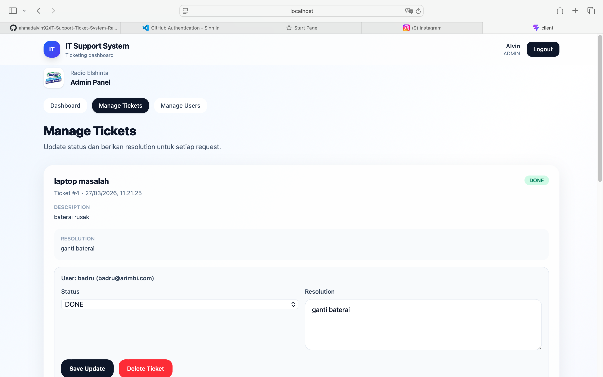

# 🎧 IT Support Ticket System - Radio Elshinta  
### Fullstack Web Application • React • Node.js • Express • PostgreSQL • Prisma

## 🌐 Landing Page

---

## 🔐 Login & Register

  
  

---

## 🛠 Admin Dashboard

---

## 🎫 Manage Tickets

---

## 👥 Manage Users

---

## 👤 User Dashboard

---

## ➕ Create Ticket

---

## 📄 My Tickets

---

# 🎧 IT Support Ticket System - Radio Elshinta

Aplikasi fullstack untuk manajemen ticket IT Support internal Radio
Elshinta.

Aplikasi ini memungkinkan user melaporkan kendala IT dan membantu admin
dalam mengelola, memantau, serta menyelesaikan masalah secara
terstruktur dan real-time.

------------------------------------------------------------------------

## 🚀 Fitur Utama

### 👤 User

-   Register & Login
-   Membuat ticket laporan
-   Melihat ticket milik sendiri
-   Tracking status (Open, In Progress, Done)

### 🛠 Admin

-   Melihat semua ticket
-   Update status & resolution
-   Hapus ticket
-   Kelola user (CRUD)

### 🌐 Landing Page

-   Statistik laporan (real-time dari database)
-   Jumlah user
-   Recent reports (aktivitas pelapor terbaru)

------------------------------------------------------------------------

## 🏗 Tech Stack

-   Frontend: React (Vite) + Tailwind CSS
-   Backend: Node.js + Express
-   Database: PostgreSQL
-   ORM: Prisma
-   Authentication: JWT

------------------------------------------------------------------------

## 📂 Struktur Project

IT-Support-Ticket-System-Radio-Elshinta/ ├── client/ ├── server/ └──
README.md

------------------------------------------------------------------------

## ⚙️ Cara Instalasi & Menjalankan Project

### Clone Repository

git clone
https://github.com/ahmadalvin92/IT-Support-Ticket-System-Radio-Elshinta.git
cd IT-Support-Ticket-System-Radio-Elshinta

------------------------------------------------------------------------

## 🔧 Setup Backend

cd server npm install

Buat file .env:

PORT=5001
DATABASE_URL="postgresql://macbook@localhost:5432/itsupport_db?schema=public"
JWT_SECRET="supersecretkey"

npx prisma migrate dev --name init npm run dev

------------------------------------------------------------------------

## 💻 Setup Frontend

cd ../client npm install npm run dev

Frontend: http://localhost:5173\
Backend: http://localhost:5001

------------------------------------------------------------------------

## 🔗 API Config

client/src/api/axios.js

baseURL: 'http://localhost:5001/api'

------------------------------------------------------------------------

## 🔐 Setup Admin

cd server\
npx prisma studio

Ubah role user jadi: ADMIN

------------------------------------------------------------------------

## ⚠️ Catatan

-   PostgreSQL harus aktif
-   Gunakan Node.js LTS (v20)
-   Jangan commit .env

------------------------------------------------------------------------

## 👨‍💻 Developer

Ahmad Alvin Griffin\
https://github.com/ahmadalvin92/IT-Support-Ticket-System-Radio-Elshinta

------------------------------------------------------------------------

Linkedin : 
https://www.linkedin.com/in/ahmad-alvin-griffin/
